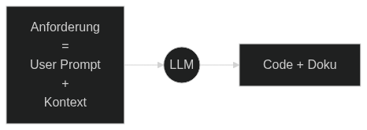
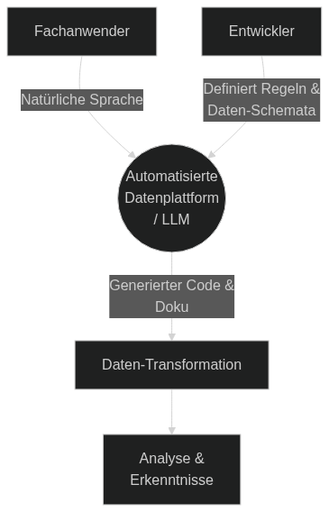
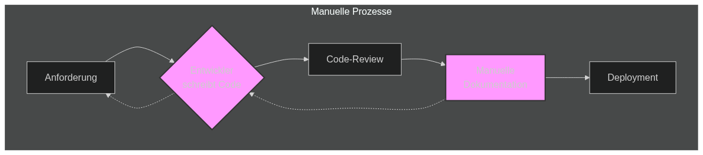
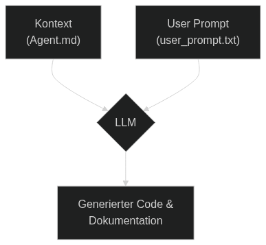
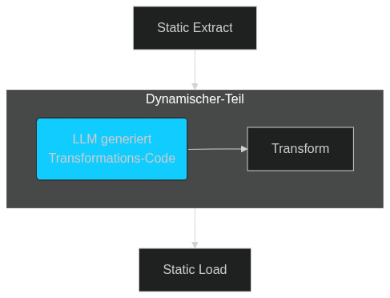
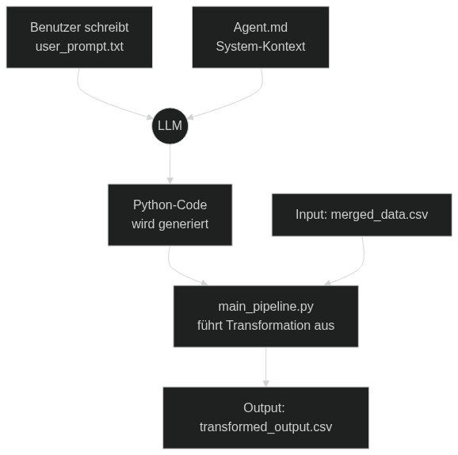
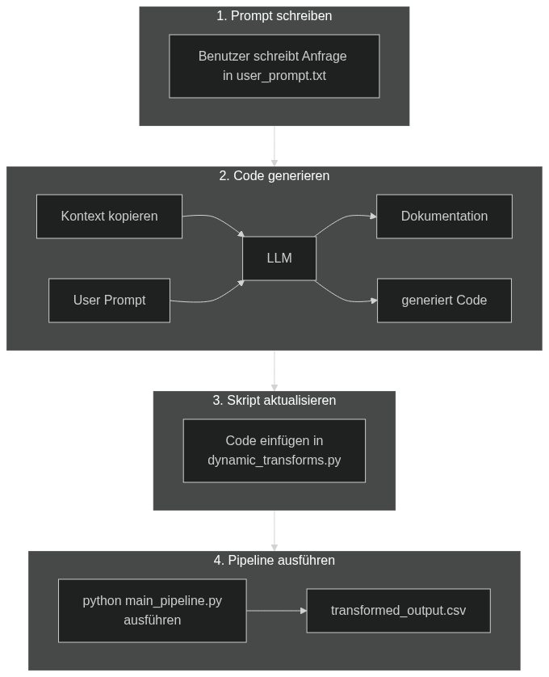

# **LLMs zur Automatisierung von ETL-Pipelines und Dokumentation**

**Projektaufgabe: Data Engineering**
_12. Januar 2026_

<!--
Guten Tag zusammen. Mein Name ist Solomon Obinna Ozoemenam und heute präsentiere ich mein Projekt zum Thema "LLMs zur Automatisierung von ETL-Pipelines und Dokumentation".
-->

---

## **Agenda**

- **Zentrale Ergebnisse**

- **Theoretische Grundlagen**

  - Grundlagen: Was sind ETL & LLMs?
  - Die Herausforderung traditioneller ETL
  - Die LLM-gestützte Lösung & die Bedeutung des Kontexts
  - Ein neues Paradigma: Dynamische Transformationen

- **Projekteinführung & Workflow**
  - Projektübersicht & Architektur
  - Der 4-Schritte-Workflow
  - Code-Architektur & Demonstration
  - Fazit, Limitationen & Ausblick

<!--
Hier ist ein Überblick über das, was wir heute besprechen werden. Wir beginnen mit der Motivation und den theoretischen Grundlagen, die die Basis für dieses Projekt bilden. Danach werde ich das Projekt selbst vorstellen, einschließlich seines Workflows und einer Demonstration, bevor wir mit einem Fazit und der Diskussion von Limitationen abschließen.
-->

---



## **Zentrale Ergebnisse**

- **Problem**: Traditionelle ETL-Prozesse sind starr und langsam.<sup><a href="#ref-1">[1]</a></sup>
- **Lösung**: LLM-generierter **Python-Code** und **Dokumentation** aus Textanforderungen.<sup><a href="#ref-2">[2]</a></sup>
- **Ergebnis**: Ein agiles, "selbst-dokumentierendes" ETL-Framework.</sup>

<!--
Bevor wir ins Detail gehen, hier die Kernaussage meines Projekts.
Das Hauptproblem traditioneller Datenprozesse (ETL) ist, dass sie langsam, manuell und oft schlecht dokumentiert sind. Dies führt zu langen Entwicklungszyklen und hohen Wartungskosten.
Meine Lösung ist ein Framework, das ein großes Sprachmodell (LLM) nutzt, um aus einer einfachen, natürlichsprachigen Textanfrage automatisch sowohl den Python-Code für die Datentransformation als auch die zugehörige technische Dokumentation zu generieren.
Das Ergebnis ist eine extrem agile, sich selbst dokumentierende Pipeline. Diese reduziert den manuellen Aufwand drastisch und befähigt Fachexperten, die keine Programmierer sind, direkt mit den Daten zu arbeiten und komplexe Analysen anzustoßen.
-->

---

<!-- _class: default -->

# **Teil 1: Theoretische Grundlagen**

---

## **Grundlagen: Was sind ETL & LLMs?**

- **ETL**: Extract, Transform, Load – der klassische Datenprozess.<sup><a href="#ref-4">[4]</a></sup>
  - **Extract**: Daten aus Quellen holen.
  - **Transform**: Daten bereinigen & umwandeln.
  - **Load**: Daten in Zielsystem laden.
- **LLM**: Large Language Model – eine KI für Sprache.<sup><a href="#ref-5">[5]</a></sup>
  - Versteht und generiert menschlichen Text.
  - Kernkompetenz hier: **Code-Generierung**.

<!--
Kurz zu den Grundlagen, um alle auf den gleichen Stand zu bringen.
ETL steht für Extract, Transform, Load. Das ist der fundamentale Prozess in der Datenverarbeitung, um Daten aus verschiedenen Quellen zu holen, sie in das gewünschte Format zu bringen und sie dann in ein Zielsystem, wie ein Data Warehouse, zu laden. Der Transformationsschritt ist dabei traditionell der aufwändigste und unflexibelste Teil.
LLMs, oder Large Language Models, sind hochentwickelte KI-Modelle. Sie werden auf riesigen Mengen an Textdaten trainiert, um menschliche Sprache zu verstehen und selbst zu generieren. Für unser Projekt ist ihre Fähigkeit, aus einer Beschreibung lauffähigen Programmcode zu erstellen, von entscheidender Bedeutung. Wir nutzen das LLM also als eine Art "programmierenden Assistenten".
-->

---



## **Motivation: Warum ist dieses Thema relevant?**

- **Demokratisierung der Daten**: Fachanwender können Analysen selbst anstoßen.<sup><a href="#ref-6">[6]</a></sup>
- **Agilität & Geschwindigkeit**: Schnellere Iterationszyklen als bei traditioneller Entwicklung.<sup><a href="#ref-7">[7]</a></sup>
- **"Lebende" Dokumentation**: Code und Doku werden zusammen generiert und sind immer aktuell.<sup><a href="#ref-8">[8]</a></sup>

<!--
Warum ist dieses Thema gerade jetzt so relevant? Es gibt drei Haupttreiber, die dieses Projekt motivieren.
Erstens die "Demokratisierung" der Daten. Wir ermöglichen Fachanwendern – also den Menschen, die die Daten und den Geschäftskontext am besten verstehen – komplexe Datentransformationen selbst anzustoßen, ohne dafür Code schreiben zu müssen. Das baut Hürden ab und verlagert die Macht zu den Experten.
Zweitens führt dies zu einer enormen Steigerung der Agilität. Traditionelle Prozesse, bei denen ein Fachexperte ein Ticket für einen Entwickler schreibt, sind langsam. Mit diesem Ansatz können neue Anforderungen statt in Wochen in Stunden oder sogar Minuten umgesetzt werden.
Und drittens schaffen wir eine "lebende" Dokumentation. Ein notorisches Problem in der IT ist veraltete Dokumentation. Da hier Code und Dokumentation gemeinsam aus derselben Quelle generiert werden, ist die Doku per Definition immer aktuell und konsistent. Das verhindert Wissenssilos und erleichtert die Wartung.
-->

---



## **Die Herausforderung traditioneller ETL**

- Hoher manueller Aufwand
- Veraltete oder fehlende Dokumentation
- Langsame Entwicklungszyklen & hohe Wartungskosten<sup><a href="#ref-9">[9]</a></sup>

<!--
Beginnen wir mit dem Kernproblem, das dieses Projekt adressiert. ETL ist ein fundamentaler Prozess in jedem datengetriebenen Unternehmen, aber die traditionelle Herangehensweise ist mit erheblichen Herausforderungen verbunden.
Der manuelle Aufwand für das Programmieren, Testen und Anpassen von Transformationslogik ist immens. Jede noch so kleine Änderung an einer Geschäftsanforderung kann einen aufwändigen Entwicklungs- und Freigabeprozess nach sich ziehen.
Ein noch größeres, schleichendes Problem ist die Dokumentation. Sie wird im Projektalltag oft vernachlässigt, was dazu führt, dass sie schnell veraltet, unvollständig oder inkonsistent mit dem tatsächlichen Code ist. Dieses "technische Schuld" macht die Wartung und Weiterentwicklung zu einem Albtraum.
Diese Faktoren – hoher manueller Aufwand und mangelhafte Dokumentation – führen unweigerlich zu langsamen Entwicklungszyklen, hohen Wartungskosten und einer geringen Agilität des gesamten Unternehmens.
-->

---



## **Die Lösung: LLM, Kontext & Prompt**

- **LLM als "Übersetzer"**: Wandelt Textanforderung in Code & Doku um.<sup><a href="#ref-10">[10]</a></sup>
- **Zwei Arten von Input**: Entscheidend für die Qualität.<sup><a href="#ref-11">[11]</a></sup>
  - **System-Kontext (`Agent.md`)**: Statische "DNA" des Projekts (Schema, Regeln, Formate).
  - **User-Prompt (`user_prompt.txt`)**: Dynamische, anforderungsspezifische Aufgabe.

<!--
Die Lösung für diese Herausforderungen liegt darin, ein LLM als intelligenten Übersetzer von menschlicher Sprache zu maschinenlesbarem Code einzusetzen. Ein LLM ist jedoch kein Magier; die Qualität seines Outputs hängt direkt von der Qualität des Inputs ab. Das Prinzip "Garbage in, garbage out" gilt hier in besonderem Maße.

Der Schlüssel zum Erfolg ist daher eine saubere Trennung und Kombination von zwei Arten von Informationen:
Erstens, der stabile **Kontext**. Ich nenne das die "DNA" des Projekts. Dies ist eine einmalige Einrichtung, die in der Datei `Agent.md` gespeichert ist. Sie enthält alle grundlegenden Informationen, die das LLM immer benötigt: die genauen Daten-Schemata, technische Regeln, Namenskonventionen und die gewünschten Ausgabeformate für Code und Dokumentation.
Zweitens, der dynamische **User Prompt**. Dies ist die eigentliche, sich ständig ändernde Benutzeranfrage, die in der `user_prompt.txt` steht.

Nur wenn wir dem LLM beides – den stabilen, reichen Kontext UND den präzisen, aufgabenspezifischen Prompt – zusammen geben, kann es zuverlässig nützliche und korrekte Ergebnisse liefern.
-->

---



## **Ein neues Paradigma: Dynamische Transformationen**

- **Statische Basis**: `Extract` & `Load` bleiben robust und unveränderlich.
  - _(Projekt-Fokus: CSV-Dateien zur Komplexitätsreduktion)_
- **Dynamischer Kern**: Der `Transform`-Schritt wird flexibel.
  - Logik wird bei Bedarf vom LLM generiert.
- **Das Beste aus zwei Welten**: Kombiniert Zuverlässigkeit mit Flexibilität.

<!--
Dieses Vorgehen führt uns zu einem neuen, hybriden ETL-Paradigma.
Wir erfinden das Rad nicht neu, sondern kombinieren bewährte Praktiken mit neuen Möglichkeiten.
Die Schritte **Extrahieren** und **Laden** der Pipeline bleiben statisch und robust. Das sind die Teile, die sich selten ändern. Für dieses Projekt habe ich mich bewusst auf das Lesen und Schreiben von CSV-Dateien beschränkt, um die Komplexität zu managen und den Fokus auf den Transformationsschritt zu legen.
Der entscheidende Unterschied ist der **Transformieren**-Schritt. Dieser wird zu einer vollständig dynamischen Komponente. Statt fest codierter Logik wird der Python-Code für die Transformation bei jeder neuen Anforderung vom LLM on-demand generiert.
Dieser Ansatz kombiniert die Zuverlässigkeit einer traditionellen, stabilen Architektur mit der unglaublichen Flexibilität und Geschwindigkeit, die LLMs bieten.
-->

---

# **Teil 2: Projekteinführung**

---



## **Projektübersicht & Architektur**

- **Ziel**: Eine ETL-Pipeline mit dynamisch generierter Transformationslogik.
- **Technologie**: Python & die `pandas`-Bibliothek.

<!--
Kommen wir nun zur konkreten Umsetzung in meinem Projekt.
Das Ziel war es, ein Framework zu schaffen, das genau dieses Paradigma der dynamischen Transformation implementiert. Die gesamte Umsetzung erfolgte in Python, wobei die `pandas`-Bibliothek das Herzstück für alle Datenmanipulationen bildet.
Das Diagramm zeigt den gesamten Ablauf: Der Benutzer formuliert seine Anforderung in der `user_prompt.txt`. Diese wird mit dem System-Kontext aus `Agent.md` kombiniert, um einen umfassenden Befehl für das LLM zu erstellen. Das LLM generiert daraufhin den Python-Code, der von der `main_pipeline.py` ausgeführt wird, um die Eingabedaten zu verarbeiten und das Ergebnis zu speichern.
-->

---

## **Der 4-Schritte-Workflow**

1.  **Prompt schreiben** (`user_prompt.txt`)
2.  **Code generieren** (mit LLM)
3.  **Skript aktualisieren** (`dynamic_transforms.py`)
4.  **Pipeline ausführen** (`main_pipeline.py`)



<!--
Der daraus resultierende Workflow für den Anwender ist bewusst einfach und auf vier Schritte reduziert.

1.  **Prompt schreiben**: Der Fachanwender oder Analyst formuliert seine Anforderung in einfacher Sprache in der Datei `user_prompt.txt`.
2.  **Code generieren**: Ein Skript (oder manueller Kopiervorgang) schickt den Prompt zusammen mit dem System-Kontext an das LLM und empfängt den generierten Python-Code.
3.  **Skript aktualisieren**: Der generierte Code wird in die Datei `dynamic_transforms.py` eingefügt. Dieser Schritt ist ein wichtiger "Human-in-the-Loop"-Kontrollpunkt, um den Code vor der Ausführung zu überprüfen.
4.  **Pipeline ausführen**: Der Benutzer startet die `main_pipeline.py`. Dieses Skript liest die Rohdaten, wendet die frisch generierte Transformationslogik an und speichert das Ergebnis.
-->

---

## **Code-Architektur**

```
.
├── etl/                  # Statische Logik
│   ├── extract.py
│   └── load.py
├── transforms/
│   └── dynamic_transforms.py # DYNAMISCHE LOGIK
├── main_pipeline.py      # Orchestrator
├── Agent.md              # Kontext: Datenschema & Prompt-Vorlage
└── user_prompt.txt       # Kontext: Benutzeranfrage
```

<!--
Die Code-Architektur spiegelt die Trennung von statischer und dynamischer Logik wider und ist auf Klarheit und Wartbarkeit ausgelegt.
- Der `etl`-Ordner enthält die stabilen, wiederverwendbaren Skripte für das Extrahieren der Quelldaten und das Laden der Ergebnisse.
- Im `transforms`-Ordner befindet sich die entscheidende Datei `dynamic_transforms.py`. Sie ist der Container für die vom LLM generierte Logik.
- Die `main_pipeline.py` fungiert als zentraler Orchestrator. Sie ruft nacheinander die Extract-, Transform- und Load-Funktionen auf und steuert den gesamten Prozess.
- Die Textdateien `Agent.md` und `user_prompt.txt` sind keine Skripte, sondern das Herz des Prompting-Frameworks. Sie liefern dem LLM den notwendigen Kontext und die spezifische Aufgabe.
-->

---

## **Demonstration: Von der Anfrage zum Ergebnis**

**1. Benutzer-Prompt:**

```txt
Filtern Sie auf 'Bioabfall FFM' mit Gewicht > 1000 KG.
```

**2. Generierter Code:**

```python
def apply_transform(df):
    # ... filter logic ...
    return df
```

**3. Generierte Dokumentation:**

```md
## Bioabfall-Filter

Filtert Datensätze für 'Bioabfall FFM' über 1000 KG.
```

<!--
Lassen Sie uns den Prozess an einem konkreten Beispiel durchspielen.
1.  **Der Benutzer-Prompt**: Der Anwender möchte alle Einträge für 'Bioabfall FFM' sehen, bei denen das Gewicht über 1000 KG liegt. Er schreibt genau das in die `user_prompt.txt`.
2.  **Der generierte Code**: Das LLM erhält diesen Prompt zusammen mit dem Schema der Datentabelle. Es versteht die Spaltennamen wie 'Gewicht' und generiert eine Python-Funktion mit `pandas`, die genau diesen Filter implementiert.
3.  **Die generierte Dokumentation**: Gleichzeitig erstellt das LLM eine kurze, prägnante Markdown-Dokumentation, die beschreibt, was diese Transformation tut.

Wenn die Pipeline als Nächstes ausgeführt wird, importiert sie die `apply_transform`-Funktion und wendet sie auf die Daten an, um das gewünschte, gefilterte Ergebnis zu erzeugen.
-->

---

## **Fazit, Limitationen & Risiken**

### **Vorteile**:

- **Effizienz**: Reduziert manuellen Programmieraufwand.
- **Empowerment**: Befähigt Fachanwender zu komplexen Analysen.
- **Konsistenz**: Garantiert aktuelle und synchronisierte Dokumentation.

### **Limitationen & Risiken**:

- **Korrektheit**: Code muss überprüft werden (Human-in-the-Loop).<sup><a href="#ref-13">[13]</a></sup>
- **Prompt-Qualität**: "Garbage in, garbage out" gilt.<sup><a href="#ref-14">[11]</a></sup>
- **Sicherheit**: Vorsicht bei sensiblen Daten-Schemata und externen APIs.<sup><a href="#ref-15">[15]</a></sup>

<!--
Zusammenfassend liegen die Vorteile dieses Ansatzes auf der Hand: eine massive Reduktion des manuellen Aufwands, die Befähigung von Fachexperten und eine stets aktuelle Dokumentation, die mit dem Code synchronisiert ist.

Es ist jedoch entscheidend, realistisch zu bleiben und die Limitationen und Risiken zu benennen.
Erstens, die **Korrektheit**: Man kann sich nicht blind darauf verlassen, dass der generierte Code immer zu 100% fehlerfrei ist. Ein "Human-in-the-Loop", also ein Entwickler, der den Code kurz überprüft, ist unerlässlich, um Fehler zu vermeiden.
Zweitens, das **Prompt Engineering**: Die Qualität des Ergebnisses hängt extrem stark von der Qualität des Prompts und des bereitgestellten Kontexts ab. Vage Anfragen führen zu vagen Ergebnissen.
Drittens, die **Sicherheit**: Wenn man externe LLM-APIs wie die von OpenAI oder Google nutzt, sendet man potenziell sensible Informationen, wie z.B. interne Daten-Schemata. Hier sind strenge Richtlinien und eventuell der Einsatz von lokalen, selbst-gehosteten LLMs erforderlich.
-->

---

## **Ausblick**

- **Vollständige Automatisierung**: Direkte LLM-API-Aufrufe in die Pipeline integrieren.
- **Dynamisches E & L**: `Extract`- und `Load`-Schritte flexibler gestalten (z.B. für SQL, JSON).
- **UI-Integration**: Eine einfache Benutzeroberfläche (z.B. mit Streamlit) entwickeln.


<!--
Wo kann die Reise von hier aus hingehen? Es gibt mehrere spannende Richtungen.
- **Vollständige Automatisierung**: Der nächste logische Schritt ist, den manuellen Kopiervorgang des Codes zu eliminieren. Man könnte eine LLM-API direkt in das Pipeline-Skript integrieren, sodass der Code-Generierungs- und Ausführungsprozess nahtlos in einem Schritt erfolgt.
- **Dynamisches Extrahieren und Laden**: Aktuell sind die E- und L-Schritte auf CSV-Dateien zugeschnitten. Man könnte das LLM auch dafür nutzen, dynamisch Code zum Lesen aus SQL-Datenbanken oder zum Schreiben in verschiedene Formate wie JSON oder Parquet zu generieren.
- **Benutzeroberfläche**: Um die Hürden für Fachanwender weiter zu senken, könnte eine einfache Web-Oberfläche, beispielsweise mit Streamlit oder Gradio, erstellt werden. Dort könnten Benutzer ihre Anfragen direkt in ein Textfeld eingeben und die Ergebnisse visualisiert bekommen.
-->

---

<!-- _class: default -->

# Referenzen

<p id="ref-1"><b>[1]</b> <a href="https://doi.org/10.58812/esiscs.v1i03.523">R. K. Srirangam, “The Growing Trend of Cloud-Based Data Integration and Warehousing,” Int. J. Sci. Res. Comput. Sci. Eng. Inf. Technol., vol. 10, no. 5.</a></p>
<p id="ref-2"><b>[2]</b> <a href="https://arxiv.org/abs/2508.00083">Dong, Yihong, et al. "A survey on code generation with llm-based agents." arXiv preprint arXiv:2508.00083 (2025).</a></p>
<p id="ref-4"><b>[4]</b> <a href="https://doi.org/10.32604/jbd.2023.046223">Khan, B., Jan, S., Khan, W., & Chughtai, M. I. (2024). An Overview of ETL Techniques, Tools, Processes and Evaluations in Data Warehousing. Journal on Big Data, 6, 1–20.</a></p>
<p id="ref-5"><b>[5]</b> <a href="https://arxiv.org/abs/2406.00515">Jiang, Juyong, et al. "A survey on large language models for code generation." arXiv preprint arXiv:2406.00515 (2024).</a></p>
<p id="ref-6"><b>[6]</b> <a href="https://www.researchgate.net/publication/354906721_Data_democratization_toward_a_deeper_understanding/citations">Lefebvre, Hippolyte, Christine Legner, and Martin Fadler. "Data democratization: toward a deeper understanding." ICIS. 2021.</a></p>
<p id="ref-7"><b>[7]</b> <a href="https://books.google.de/books?id=NsucBAAAQBAJ">Hughes, Ralph. Agile data warehousing for the enterprise: a guide for solution architects and project leaders. Newnes, 2015.</a></p>
<p id="ref-8"><b>[8]</b> <a href="https://books.google.de/books?id=KdAEb0MOQCwC">Rüping, Andreas. Agile documentation: a pattern guide to producing lightweight documents for software projects. John Wiley & Sons, 2005.</a></p>

---

<!-- _class: default -->

# Referenzen (Fortsetzung)

<p id="ref-9"><b>[9]</b> <a href="https://www.theseus.fi/bitstream/handle/10024/853678/Tran_Trung.pdf">Tran, Trung. "In-depth Analysis and Evaluation of ETL Solutions for Big Data Processing." (2024).</a></p>
<p id="ref-10"><b>[10]</b> <a href="https://arxiv.org/abs/2108.07732">Austin, Jacob, et al. "Program synthesis with large language models." arXiv preprint arXiv:2108.07732 (2021).</a></p>
<p id="ref-11"><b>[11]</b> <a href="https://link.springer.com/chapter/10.1007/978-981-99-7962-2_30">Marvin, Ggaliwango, et al. "Prompt engineering in large language models." International conference on data intelligence and cognitive informatics. Singapore: Springer Nature Singapore, 2023.</a></p>
<p id="ref-13"><b>[13]</b> <a href="https://arxiv.org/abs/2501.16857">Licorish, Sherlock A., et al. "Comparing Human and LLM Generated Code: The Jury is Still Out!." arXiv preprint arXiv:2501.16857 (2025).</a></p>
<p id="ref-15"><b>[15]</b> <a href="https://dl.acm.org/doi/full/10.1145/3712001">Das, Badhan Chandra, M. Hadi Amini, and Yanzhao Wu. "Security and privacy challenges of large language models: A survey." ACM Computing Surveys 57.6 (2025): 1-39.</a></p>

---

<!-- _class: lead -->

# **Vielen Dank!**

## Fragen?
