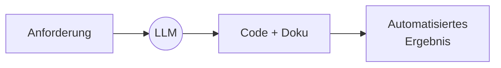
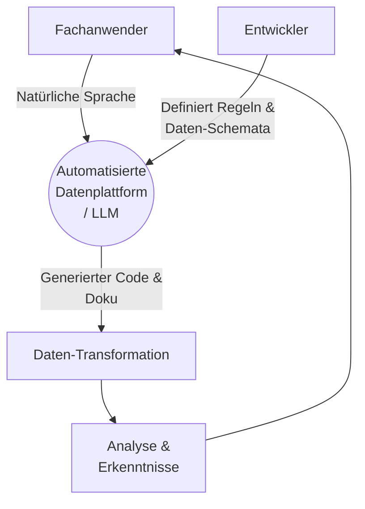
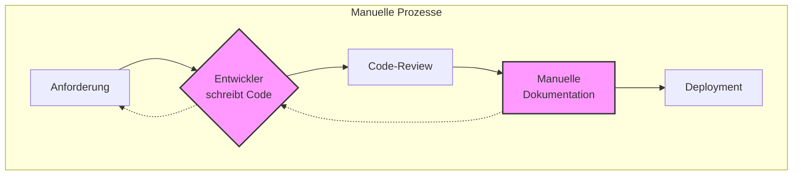
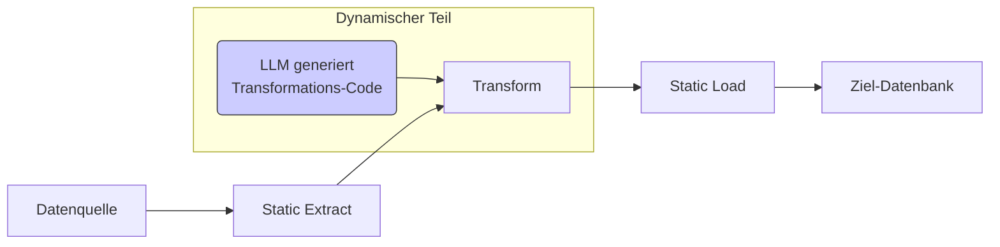
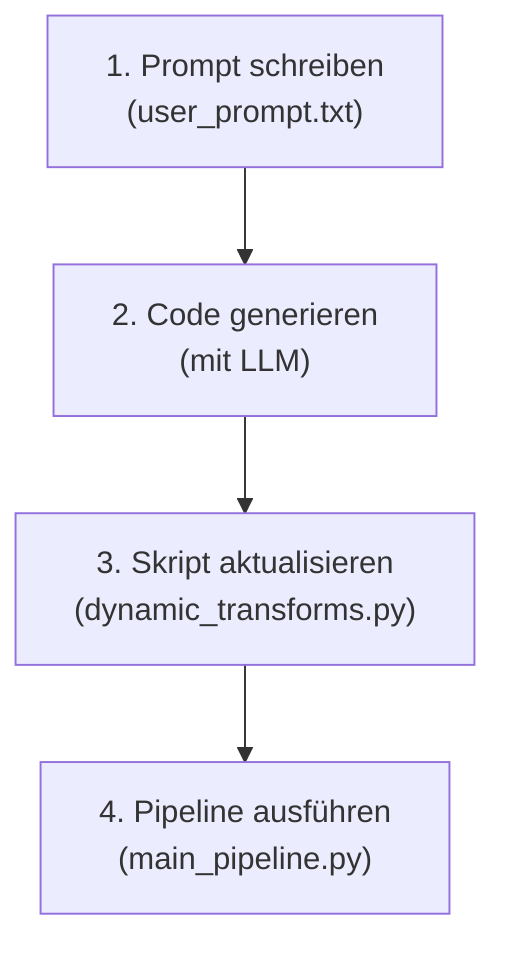

# **LLMs zur Automatisierung von ETL-Pipelines und Dokumentation**

**Projektaufgabe: Data Engineering**
_12. Januar 2026_

<!--
Guten Tag zusammen. Mein Name ist [Ihr Name] und heute präsentiere ich mein Projekt zum Thema "LLMs zur Automatisierung von ETL-Pipelines und Dokumentation".
-->

---

<style scoped>
  section { font-size: 1.7em; }
</style>

## **Agenda**

- **Zentrale Ergebnisse (Executive Summary)**

- **Theoretische Grundlagen**

  - Motivation: Warum jetzt?
  - Die Herausforderung traditioneller ETL
  - Die LLM-gestützte Lösung & die Bedeutung des Kontexts
  - Ein neues Paradigma: Dynamische Transformationen

- **Projekteinführung & Workflow**
  - Projektübersicht & Ziele
  - Der 4-Schritte-Workflow
  - Code-Architektur & Demonstration
  - Fazit, Limitationen & Ausblick

<!--
Hier ist ein Überblick über das, was wir heute besprechen werden. Wir beginnen mit der Motivation und den theoretischen Grundlagen, die die Basis für dieses Projekt bilden. Danach werde ich das Projekt selbst vorstellen, einschließlich seines Workflows und einer Demonstration, bevor wir mit einem Fazit und der Diskussion von Limitationen abschließen.
-->

---

## **Zentrale Ergebnisse (Executive Summary)**

- **Problem**: Traditionelle ETL-Prozesse sind langsam, manuell und schlecht dokumentiert.
- **Lösung**: Dieses Projekt nutzt ein LLM, um aus einer einfachen Textanforderung automatisch sowohl den **Python-Code** für die Datentransformation als auch die zugehörige **Dokumentation** zu generieren.
- **Ergebnis**: Ein agiles, "selbst-dokumentierendes" ETL-Framework, das den Entwicklungsaufwand erheblich reduziert und Fachexperten direkt einbindet.



<!--
Bevor wir ins Detail gehen, hier die Kernaussage meines Projekts:
Das Hauptproblem traditioneller Datenprozesse ist, dass sie langsam und schlecht dokumentiert sind.
Meine Lösung ist ein Framework, das ein großes Sprachmodell nutzt, um aus einer einfachen Textanfrage automatisch sowohl den Code als auch die Dokumentation zu generieren.
Das Ergebnis ist eine extrem agile, sich selbst dokumentierende Pipeline, die den manuellen Aufwand drastisch senkt und Fachexperten befähigt, direkt mit den Daten zu arbeiten.
-->

---

<!-- _class: default -->

# **Teil 1: Theoretische Grundlagen**

---

## **Motivation: Warum ist dieses Thema relevant?**

- **"Demokratisierung" der Daten**: Fachanwender ohne tiefe Programmierkenntnisse können komplexe Analysen selbst anstoßen.
- **Agilität & Geschwindigkeit**: Deutlich schnellere Iterationszyklen im Vergleich zu traditionellen, ticket-basierten Entwicklungsprozessen.
- **"Lebende" Dokumentation**: Die automatisch generierte Dokumentation dient als Wissensdatenbank, verhindert Wissenssilos und ist immer aktuell.



<!--
Warum ist dieses Thema gerade jetzt so relevant? Es gibt drei Haupttreiber.
Erstens die "Demokratisierung" der Daten. Durch die Übersetzung von natürlicher Sprache zu Code können Fachanwender, die die Daten am besten kennen, selbst komplexe Transformationen anstoßen, ohne auf Entwicklerressourcen warten zu müssen.
Zweitens führt dies zu einer enormen Steigerung der Agilität. Statt wochenlanger Zyklen für die Umsetzung können neue Anforderungen in Stunden oder Minuten realisiert werden.
Und drittens schaffen wir eine "lebende" Dokumentation. Da Code und Doku zusammen generiert werden, gehört das Problem veralteter Dokumentationen der Vergangenheit an.
-->

---

## **Die Herausforderung traditioneller ETL**

- Hoher manueller Aufwand
- Veraltete oder fehlende Dokumentation
- Langsame Entwicklungszyklen & hohe Wartungskosten



<!--
Beginnen wir mit dem Kernproblem. ETL ist ein fundamentaler Prozess, aber traditionell mit erheblichen Herausforderungen verbunden.
Der manuelle Aufwand für das Schreiben und Anpassen von Transformationslogik ist enorm.
Ein noch größeres Problem ist oft die Dokumentation. Sie wird häufig vernachlässigt, ist veraltet oder inkonsistent.
Diese Faktoren führen unweigerlich zu langsamen Entwicklungszyklen und hohen Wartungskosten.
-->

---

## **Die Lösung & die Bedeutung des Kontexts**

- **LLM als "Übersetzer"**: Wandelt Anforderung in Code & Doku um.
- **Kontext ist der Schlüssel**: "Garbage in, garbage out."
- **Master-Prompt**: Bündelt allen nötigen Kontext für das LLM.
  - **Daten-Schema**: Was sind die Daten?
  - **Anweisungen**: Wie soll die Ausgabe aussehen?
  - **Benutzeranfrage**: Was soll getan werden?

---

```mermaid
graph TD
    subgraph "Kontext-Komponenten"
        A[Daten-Schema<br>(Agent.md)]
        B[Benutzeranfrage<br>(user_prompt.txt)]
        C[Anweisungen & Regeln]
    end

    A --> D{Master-Prompt}
    B --> D
    C --> D

    D --> E((LLM))

    E --> F[Generierter Code &<br>Dokumentation]
```

<!--
Die Lösung liegt darin, ein LLM als intelligenten Übersetzer einzusetzen. Aber ein LLM ist kein Magier. Die Qualität des Ergebnisses hängt direkt von der Qualität des Inputs ab. Hier gilt das Prinzip: "Garbage in, garbage out."

Der Schlüssel zum Erfolg ist daher, dem LLM den richtigen Kontext zu geben. In diesem Projekt besteht der Kontext aus drei Säulen, die zu einem "Master-Prompt" zusammengefügt werden:
Erstens, ein detailliertes Daten-Schema, das dem LLM sagt, wie die Daten aussehen.
Zweitens, klare Anweisungen, wie es seine Ausgabe formatieren soll.
Und drittens, die eigentliche Benutzeranfrage.
Nur mit diesem gebündelten Kontext kann das LLM präzise und nützliche Ergebnisse liefern.
-->

---

## **Ein neues Paradigma: Dynamische Transformationen**

- **Statische ETL (Extrahieren & Laden)**: Robuste, unveränderliche Basis.
- **Dynamischer "Transformieren"-Schritt**: Flexible, bei Bedarf vom LLM generierte Logik.
- Kombiniert **Zuverlässigkeit** mit **Flexibilität**.

---



<!--
Dies führt uns zu einem neuen ETL-Paradigma.
Wir behalten die statischen, robusten Teile der Pipeline bei – das Extrahieren der Rohdaten und das Laden der Zieldaten.
Der entscheidende Unterschied ist der "Transformieren"-Schritt. Dieser wird zu einer dynamischen, austauschbaren Komponente, deren Logik bei Bedarf von einem LLM generiert wird.
Dieser Ansatz kombiniert die Zuverlässigkeit einer traditionellen Architektur mit der unglaublichen Flexibilität, die LLMs bieten.
-->

---

<!-- _class: default -->

# **Teil 2: Projekteinführung**

---

## **Projektübersicht: Ein LLM-gestütztes ETL-Framework**

- **Ziel**: Eine ETL-Pipeline mit dynamisch generierter Transformationslogik.
- **Technologie**: Python & pandas.

```mermaid
graph TD
    A[Benutzer schreibt<br>user_prompt.txt] --> B{Master-Prompt<br>wird erstellt};
    C[Agent.md<br>(Schema)] --> B;
    D[prompt_template.txt] --> B;
    B --> E((LLM));
    E --> F[dynamic_transforms.py<br>wird aktualisiert];
    F --> G[main_pipeline.py<br>führt Transformation aus];
    H[merged_data.csv] --> G;
    G --> I[transformed_output.csv];
```

<!--
Kommen wir nun zur konkreten Umsetzung in meinem Projekt.
Das Ziel war es, ein Framework zu schaffen, das genau dieses Paradigma der dynamischen Transformation implementiert.
Die gesamte Umsetzung erfolgte in Python, wobei die `pandas`-Bibliothek das Herzstück der Datenmanipulation bildet.
-->

---

## **Der 4-Schritte-Workflow**

1.  **Prompt schreiben** (`user_prompt.txt`)
2.  **Code generieren** (mit LLM)
3.  **Skript aktualisieren** (`dynamic_transforms.py`)
4.  **Pipeline ausführen** (`main_pipeline.py`)




<!--
Der daraus resultierende Workflow ist einfach und benutzerzentriert.

Zuerst schreibt der Benutzer seine Anforderung in natürlicher Sprache.
Zweitens generiert er mit einem LLM den Code.
Drittens fügt er den generierten Code in die dafür vorgesehene Python-Datei ein.
Und schließlich führt er das Hauptskript aus, das die gesamte Pipeline orchestriert.
-->

---

## **Code-Architektur**

```
.
├── etl/                  # Statische Logik
│   ├── extract.py
│   └── load.py
├── transforms/
│   └── dynamic_transforms.py # DYNAMISCHE LOGIK
├── main_pipeline.py      # Orchestrator
├── Agent.md              # Kontext: Datenschema
├── prompt_template.txt   # Kontext: Vorlage
└── user_prompt.txt       # Kontext: Benutzeranfrage
```

<!--
Die Code-Architektur spiegelt diese Trennung von statischer und dynamischer Logik wider.
Der `etl`-Ordner enthält die statischen Skripte.
Im `transforms`-Ordner befindet sich die Datei für den LLM-generierten Code.
Die `main_pipeline.py` ist der Orchestrator, der alles zusammenfügt.
Die übrigen Textdateien bilden das Prompting-Framework, das dem LLM den notwendigen Kontext liefert.
-->

---

## **Demonstration: Von der Anfrage zum Ergebnis**

**1. Benutzer-Prompt:**

```txt
Filtern Sie auf 'Bioabfall FFM' mit Gewicht > 1000 KG.
```

**2. Generierter Code:**

```python
def apply_transform(df):
    # ... filter logic ...
    return df
```

**3. Generierte Dokumentation:**

```md
## Bioabfall-Filter

Filtert Datensätze für 'Bioabfall FFM' über 1000 KG.
```

<!--
Hier sehen wir den Prozess im Überblick.
Auf der linken Seite steht die einfache Benutzeranfrage.
In der Mitte sehen wir den vom LLM generierten Python-Code, der diese Anfrage umsetzt.
Und rechts die automatisch erstellte Dokumentation.
Wenn die Pipeline läuft, wird genau dieser Code ausgeführt, um das Endergebnis zu erzeugen.
-->

---

## **Fazit & Limitationen**

### **Wesentliche Vorteile**:

- Reduziert manuellen Aufwand
- Ermöglicht Fachanwendern komplexe Transformationen
- Garantiert synchronisierte Dokumentation

### **Limitationen & Risiken**:

- **Korrektheit**: Generierter Code erfordert Überprüfung ("Human-in-the-Loop").
- **Prompt Engineering**: Ergebnisqualität hängt stark von der Prompt-Qualität ab.
- **Sicherheit**: Vorsicht beim Senden sensibler Schemainformationen an externe LLM-APIs.


<!--
Zusammenfassend lässt sich sagen, dass die Vorteile auf der Hand liegen: weniger Aufwand, mehr Power für Fachexperten und immer aktuelle Dokumentation.

Es ist jedoch wichtig, auch die Limitationen zu erwähnen. Der generierte Code ist nicht immer perfekt und muss überprüft werden. Die Qualität des Ergebnisses hängt stark von der Qualität des Prompts ab. Und bei der Nutzung externer LLMs müssen Sicherheitsaspekte, insbesondere bei sensiblen Daten-Schemata, berücksichtigt werden.
-->

---

## **Ausblick**

- **Vollständige Automatisierung**: Direkter LLM-API-Aufruf in das Pipeline-Skript integrieren.
- **UI-Integration**: Eine einfache Benutzeroberfläche (z.B. mit Streamlit) für eine benutzerfreundlichere Erfahrung entwickeln.
- **Breitere Unterstützung**: Mehr Datenquellen, Ziele und Transformationsbibliotheken unterstützen.


<!--
Die nächsten Schritte wären, den Prozess durch eine direkte API-Anbindung an ein LLM vollständig zu automatisieren und eventuell eine einfache Benutzeroberfläche zu entwickeln, um die Bedienung noch weiter zu vereinfachen.
-->

---

<!-- _class: lead -->

# **Vielen Dank!**

## Fragen?

<!--  -->
